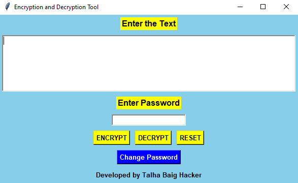

# Message Encrypt and Decrypt Tool

This Python-based **Message Encrypt and Decrypt Tool** allows users to securely encrypt and decrypt messages using Base64 encoding, with password protection. It is designed to be simple, user-friendly, and secure, using a **Tkinter** GUI to facilitate interaction.

## 📸 Screenshot



---

## Features

- **Message Encryption**: Securely encrypt messages using a custom password. The message is encoded using Base64.
- **Message Decryption**: Decrypt the encoded message back to its original form using the correct password.
- **Password Protection**: Encryption and decryption operations are protected by a password, ensuring only authorized users can access them.
- **Graphical User Interface**: Developed with **Tkinter**, the GUI provides a simple interface for interacting with the tool.

## Technologies Used

- **Python**: The primary programming language used for the development of this tool.
- **Tkinter**: A built-in Python library for creating graphical user interfaces (GUIs).
- **Base64 Encoding**: Used for encrypting and decrypting messages.
- **File Handling**: Used to securely store and read the password from a text file.

## Installation

To get this project up and running, follow the instructions below:

### Prerequisites:
- **Python 3.x**: Make sure you have Python installed. Download it from [here](https://www.python.org/downloads/).
- **Tkinter**: Tkinter comes pre-installed with Python, so no need to install it separately.

### Steps to Install:

1. **Clone the repository** or **download** the source code from GitHub:
   ```bash
   git clone https://github.com/talhabaig007/message-encrypt.git
- **Navigate into the project directory**:
  ```bash
  cd message-encrypt
- **Install dependencies** (if any) by using the following command:
  ```bash
  pip install -r requirements.txt
If you don’t have a **requirements.txt** file, it means there are no additional dependencies besides Python and Tkinter.
- **Run the application**:
  ```bash
  python encrypt_decrypt_tool.py
#### Note: If you don’t have **requirements.txt**, it simply means the project only requires Python and Tkinter, both of which come bundled with Python.

### Usage
**Launch the Application**:
- Navigate to the project folder and run the Python script **encrypt_decrypt_tool.py**:
  ```bash
  python encrypt_decrypt_tool.py

**Encrypt a Message**:
- Enter the message you wish to encrypt in the input field.
- Enter the password for encryption.
- Click the **Encrypt** button.
- The encrypted message will be displayed in the second text box.

**Decrypt a Message**:
- Enter the encrypted message in the input field.
- Enter the password for decryption.
- Click the Decrypt button.
- The original message will be shown if the correct password is provided.
- **Reset**: You can reset the fields by clicking the **Reset** button to clear the text boxes.
- **Change Password**: If you want to change the encryption password, click on **Change Password**, and follow the instructions provided.

### Error Handling
The tool comes with basic error handling:

- **Invalid Password**: If the incorrect password is provided for decryption, an error message will prompt.
- **Empty Message**: If the user tries to encrypt or decrypt an empty message, an error will be shown.
- **Password File Issues**: If there is an issue accessing or saving the password file, an error will be displayed.

### Author
This project was developed by:

**Talha Baig**
Ethical Hacker, Cybersecurity Expert, Developer

Contact Information:

- GitHub: [Github](https://github.com/talhabaig007/)
- Email: baig78@hackermail.com
- Facebook: [Facebook](https://www.facebook.com/p/Talha-Baig-100063795712836/)

### License
This project is open source and available under the MIT [License](MIT).


